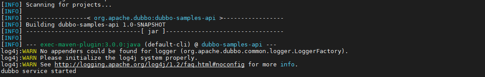

# 作业1：服务开发和调用

BY2006105 陈天宇

本文档主要用于说明实验流程和代码解释。

This document is for illustration of experiments and explaination of Code. 

```java
class Person
{
    String name;
    int age;
    boolean gender;
    set/getName();
    set/getAge();
    String sayHello()
    {
        Return "Hello World!" + name;
    }
}
```

## 基于Apach Dubbo将上述类的方法对外提供RPC服务并调用


### Config the zookeeper registry

1. download from https://zookeeper.apache.org/releases.html
2. follow the instructions on https://phoenixnap.com/kb/install-apache-zookeeper

### Start the service provider

```bash
mvn clean package
mvn -Djava.net.preferIPv4Stack=true -Dexec.mainClass=org.apache.dubbo.samples.provider.Application exec:java
```

If all things are ready, you will see the information below:




### Invoke the service consumer

Of course you can start a new node and refer to the service above. For convenience, you can start another terminal (another process) and type the following commands.

```bash
cd dubbo-samples-api
mvn -Djava.net.preferIPv4Stack=true -Dexec.mainClass=org.apache.dubbo.samples.client.Application exec:java
```

After referring to the remote service, you will see the results:


## 基于Java Spring将上述类的方法对外提供RESTful服务并调用

## Setup

```bash
cd spring-restful-demo
mvn clean package
mvn spring-boot:run
```

The service will start on localhost:8080

## Usage

The [Postman](https://www.postman.com/downloads/)  software is recommended for APIs Tests.

The results can be seen under the spring-restful-demo/results folder.

Here are some samples：


## 基于 Apache Axis2 将上述类的方法对外提供Web服务，生成WSDL文件，以及调用服务
## pre-requesitions
1. apache tomcat seervlet engine
2. apache ant
3. apache maven

### Setup
1. start tomcat engine and download the war-version of apache axis2.
2. copy the axis2.war file into {tomcat_root_dir}/webapp
3. visit the default admin page http://localhost:8080/axis2/axis2-admin and login (default username:admin, default password: axis2)  

4. switch into this folder and run apache ant to generate wsdl
```bash
cd axis-demo
mvn install
ant generate.wsdl
ant generate.service
```
after generation, you will find the PersonService.aar and PersonService.wsdl under axis2-demo/quickstart/build/
5. open the upload page http://localhost:8080/axis2/axis2-admin/upload and upload the PersonService.aar file.
6. The PersonService can be seen under the servicelist http://localhost:8080/axis2/axis2-admin/listServices


### Invoke the service

Here Curl is used to make tests.

1. set person name
2. set person age
3. set person gender
4. get person name
5. get person age
6. get person gender
7. sayHello


