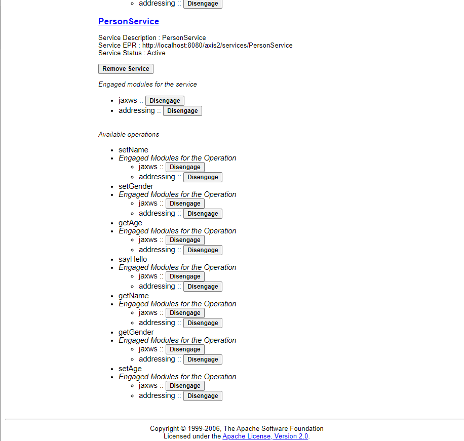

# axis2-demo-guide

## pre-requesitions
1. apache tomcat seervlet engine
2. apache ant
3. apache maven

## Setup
1. start tomcat engine and download the war-version of apache axis2.
2. copy the axis2.war file into {tomcat_root_dir}/webapp
3. visit the default admin page http://localhost:8080/axis2/axis2-admin and login (default username:admin, default password: axis2)  

4. switch into this folder and run apache ant to generate wsdl
```bash
mvn install
ant generate.wsdl
ant generate.service
```
after generation, you will find the PersonService.aar and PersonService.wsdl under axis2-demo/quickstart/build/
5. open the upload page http://localhost:8080/axis2/axis2-admin/upload and upload the PersonService.aar file.
6. The PersonService can be seen under the servicelist http://localhost:8080/axis2/axis2-admin/listServices



## Invoke the service

Here Curl is used to make tests.

1. set person name
2. set person age
3. set person gender
4. get person name
5. get person age
6. get person gender
7. sayHello

