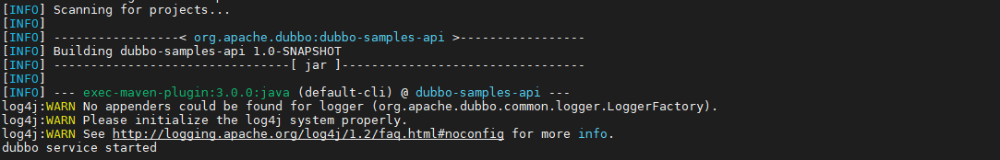
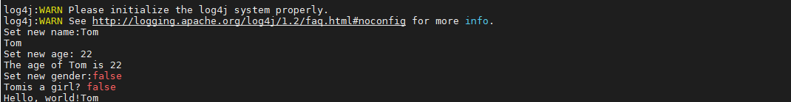

# Steps

## Config the zookeeper registry

1. download from https://zookeeper.apache.org/releases.html
2. follow the instructions on https://phoenixnap.com/kb/install-apache-zookeeper

## Start the service provider

```bash
mvn clean package
mvn -Djava.net.preferIPv4Stack=true -Dexec.mainClass=org.apache.dubbo.samples.provider.Application exec:java
```

If all things are ready, you will see the information below:




## Invoke the service consumer

Of course you can start a new node and refer to the service above. For convenience, you can start another terminal (another process) and type the following commands.

```bash
mvn -Djava.net.preferIPv4Stack=true -Dexec.mainClass=org.apache.dubbo.samples.client.Application exec:java
```

After referring to the remote service, you will see the results:



